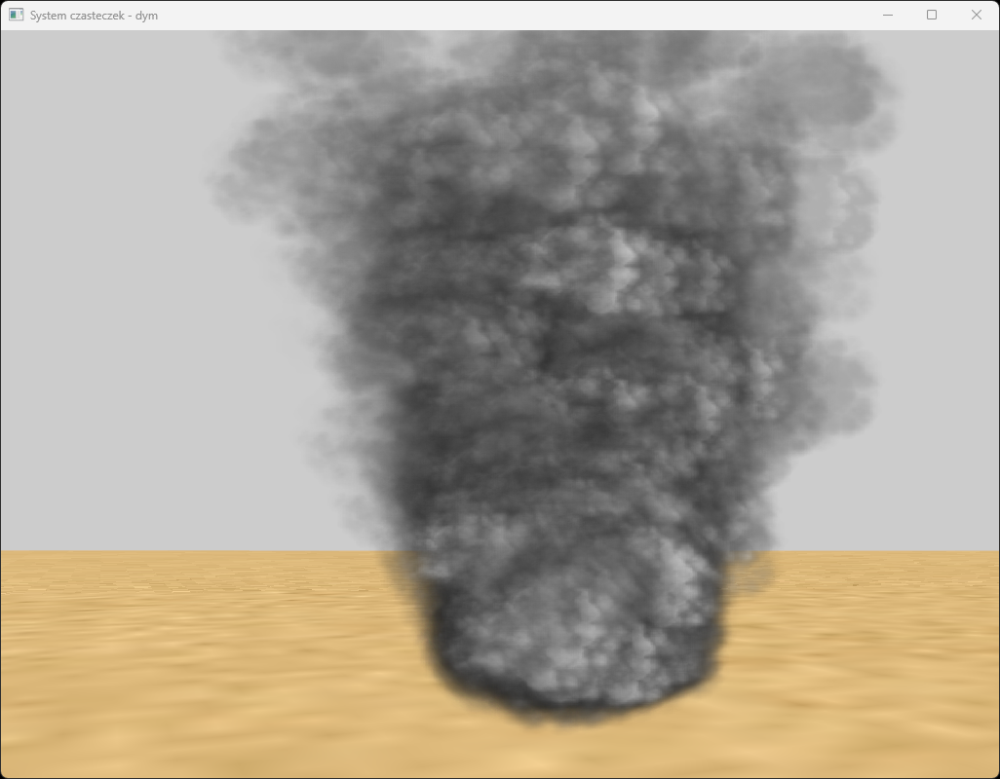

# Smoke Particle System
Simple 3D smoke effect created using particle system. App developed in 2022.

## Technologies Used
### Languages
- C++
### Libraries
- OpenGL
- FreeGLUT
- glew
- glfw
- glm
- stb_image

## Example Screenshots

